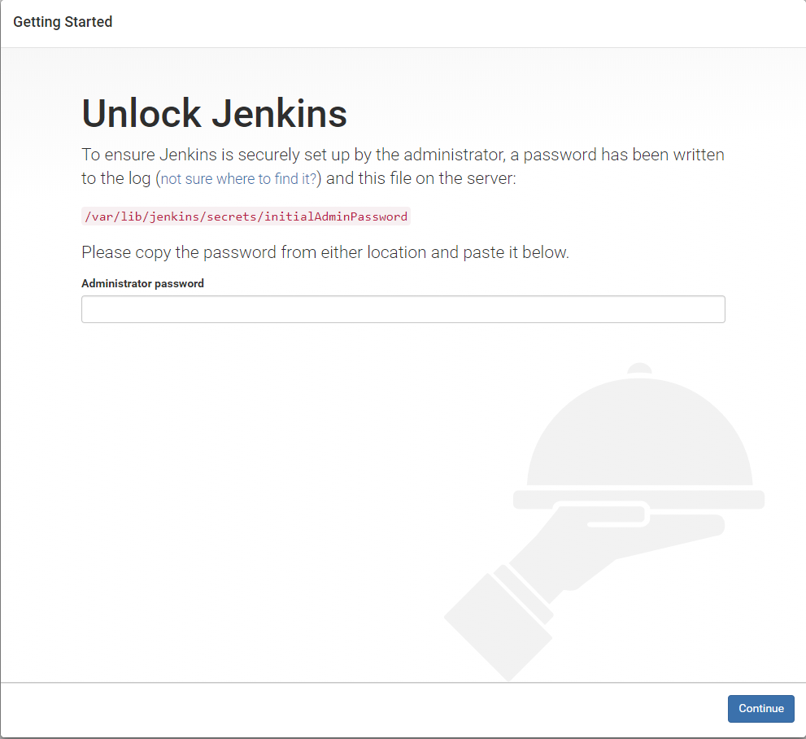

Jenkins学习记录,该学习记录主要包含环境的搭建、基础配置以及在项目中遇到的踩坑记录。   
Jenkins是一个开源软件项目，是基于Java开发的一种持续集成工具，用于监控持续重复的工作，旨在提供一个开放易用的软件平台，使软件的持续集成变成可能
<!--truncate-->

## 环境搭建

### 基础依赖
搭建设备：Ubuntu 16.04  
java环境：jdk 1.8  
jdk环境变量配置  
```
    vi /etc/profile
```
在文件末尾添加以下配置
```
    export JAVA_HOME=/root/apps/soft/jdk1.8.0_131
    export JRE_HOME=$JAVA_HOME/jre  
    export CLASSPATH=$JAVA_HOME/lib:$JRE_HOME/lib:$CLASSPATH  
    export PATH=$JAVA_HOME/bin:$JRE_HOME/bin:$PATH  
```
刷新配置，生效java环境
```
    source /etc/profile
```
使用以下命令可以查看java安装的位置
```
    whereis java
```
### 安装Jenkins
依次使用以下命令安装系统关键升级，并安装**jenkins**。
```
wget -q -O - https://pkg.jenkins.io/debian-stable/jenkins.io.key | sudo apt-key add -  

sudo sh -c 'echo deb http://pkg.jenkins.io/debian-stable binary/ > /etc/apt/sources.list.d/jenkins.list'

sudo apt-get update

sudo apt-get install jenkins

```
安装完成后Jenkins会在系统中创建一个名为***jenkins***的用户。  
并且Jenkins服务会自动启动，默认端口为 **8080**
#### Jenkins日志位置
通过上述方式安装完成后，Jenkins的日志默认存放在 **/var/log/jenkins/** 目录下。
#### Jenkins配置文件
Jenkins的默认配置文件存放在 **/etc/default/** 目录下，文件名称为 ***jenkins***其中可以配置 **端口号**、**日志存放位置**等等。
### 登陆
#### 首次登陆
首次登陆会提示要求管理员密码，如下图默认密码存放位置 **/var/lib/jenkins/secrets/initialAdminPassword**  



#### 登陆后会提示安装各种插件
1.一般选择默认安装即可，默认安装，Jenkins会默认安装社区里面jenkins认为最有用的插件，可以理解为装机必备。  
2.安装完成插件后会要求我们创建一个新的用户。  
3.创建完成后就可以启动jenkins了，完成安装配置如下图。   


#### 安装Maven插件
步骤点击**系统管理**->**管理插件**->**可选插件**->搜索**Maven Integration plugin**->选择直接安装   
安装成功页面

#### 安装SSH插件
步骤点击**系统管理**->**管理插件**->**可选插件**->搜索**Publish Over SSH**->选择直接安装   
### 配置服务器地址
步骤点击**系统管理**->**系统设置**-> **查找Publish over SSH**,按照图片所示配置服务器属性


## 创建项目并管理
### 新建任务
点击新建任务

### 配置任务
1.输入描述文字  
2.源码管理这里使用的是git，点击git输入git代码地址。  开始填写git账号密码  
在红框处填写账号密码后点击添加。完成添加后从下拉列表选择自己的账号密码。  
3.构建操作  
由于我们采用maven构建所以我们在下图画红框处填写我们的构建命令

4.构建后的操作  
构建后通过ssh插件上传至服务器上，然后启动脚本执行。


*   参数说明  
    	Source files        上传文件位置  
        Remove prefix       上传过滤删除掉文件  
        Remote directory    上传到的位置  
        Exec command        执行的命令  
## 构建项目
### 构建
配置完成后马上开始构建项目,通过右击项目然后选择立即构建后，项目就会从git上下载然后按照制定的构建策略构建。

### 查看构建进度
通过点击如图的图标，会进入到项目详情。通过项目详情中的**Console Output**就可以看到构建的日志。  


### 关于Maven 聚合项目构建报错的解决方案
Maven 存在聚合模式，旨在解决多模块复用代码等方案，但是Maven多模块聚合方式打包在目前的jenkins中存在问题，以下为报错信息.很奇怪尝试把Maven、java安装在Jenkins用户下，没有解决，在jenkins的项目目录下使用**mvn package**可以正常打包。

```
Established TCP socket on 34988
<===[JENKINS REMOTING CAPACITY]===>channel started
Executing Maven:  -N -B -f /var/lib/jenkins/workspace/copyright-monitor/cm-admin/pom.xml clean package
java.lang.NullPointerException
	at jenkins.maven3.agent.Maven33Main.launch(Maven33Main.java:176)
	at sun.reflect.NativeMethodAccessorImpl.invoke0(Native Method)
	at sun.reflect.NativeMethodAccessorImpl.invoke(NativeMethodAccessorImpl.java:62)
	at sun.reflect.DelegatingMethodAccessorImpl.invoke(DelegatingMethodAccessorImpl.java:43)
	at java.lang.reflect.Method.invoke(Method.java:498)
	at hudson.maven.Maven3Builder.call(Maven3Builder.java:139)
	at hudson.maven.Maven3Builder.call(Maven3Builder.java:70)
	at hudson.remoting.UserRequest.perform(UserRequest.java:207)
	at hudson.remoting.UserRequest.perform(UserRequest.java:53)
	at hudson.remoting.Request$2.run(Request.java:358)
	at hudson.remoting.InterceptingExecutorService$1.call(InterceptingExecutorService.java:72)
	at java.util.concurrent.FutureTask.run(FutureTask.java:266)
	at java.util.concurrent.ThreadPoolExecutor.runWorker(ThreadPoolExecutor.java:1142)
	at java.util.concurrent.ThreadPoolExecutor$Worker.run(ThreadPoolExecutor.java:617)
	at java.lang.Thread.run(Thread.java:748)
Started by user admin
Finished: ABORTED
FATAL: java.lang.reflect.InvocationTargetException
java.lang.NullPointerException
	at jenkins.maven3.agent.Maven33Main.launch(Maven33Main.java:176)
Caused: java.lang.Exception
	at jenkins.maven3.agent.Maven33Main.launch(Maven33Main.java:179)
Caused: java.lang.reflect.InvocationTargetException
	at sun.reflect.NativeMethodAccessorImpl.invoke0(Native Method)
	at sun.reflect.NativeMethodAccessorImpl.invoke(NativeMethodAccessorImpl.java:62)
	at sun.reflect.DelegatingMethodAccessorImpl.invoke(DelegatingMethodAccessorImpl.java:43)
	at java.lang.reflect.Method.invoke(Method.java:498)
	at hudson.maven.Maven3Builder.call(Maven3Builder.java:139)
Also:   hudson.remoting.Channel$CallSiteStackTrace: Remote call to Channel to Maven [/var/lib/jenkins/soft/jdk1.8.0_131/bin/java, -cp, /var/lib/jenkins/plugins/maven-plugin/WEB-INF/lib/maven35-agent-1.12-alpha-1.jar:/var/lib/jenkins/soft/apache-maven-3.5.2/boot/plexus-classworlds-2.5.2.jar:/var/lib/jenkins/soft/apache-maven-3.5.2/conf/logging, jenkins.maven3.agent.Maven35Main, /var/lib/jenkins/soft/apache-maven-3.5.2, /var/cache/jenkins/war/WEB-INF/lib/remoting-3.14.jar, /var/lib/jenkins/plugins/maven-plugin/WEB-INF/lib/maven35-interceptor-1.12-alpha-1.jar, /var/lib/jenkins/plugins/maven-plugin/WEB-INF/lib/maven3-interceptor-commons-1.12-alpha-1.jar, 34988]
		at hudson.remoting.Channel.attachCallSiteStackTrace(Channel.java:1693)
		at hudson.remoting.UserResponse.retrieve(UserRequest.java:310)
		at hudson.remoting.Channel.call(Channel.java:908)
		at hudson.maven.ProcessCache$MavenProcess.call(ProcessCache.java:161)
		at hudson.maven.MavenBuild$MavenBuildExecution.doRun(MavenBuild.java:912)
		at hudson.model.AbstractBuild$AbstractBuildExecution.run(AbstractBuild.java:504)
		at hudson.model.Run.execute(Run.java:1724)
		at hudson.maven.MavenBuild.run(MavenBuild.java:275)
		at hudson.model.ResourceController.execute(ResourceController.java:97)
		at hudson.model.Executor.run(Executor.java:421)
Caused: java.io.IOException
	at hudson.maven.Maven3Builder.call(Maven3Builder.java:179)
	at hudson.maven.Maven3Builder.call(Maven3Builder.java:70)
	at hudson.remoting.UserRequest.perform(UserRequest.java:207)
	at hudson.remoting.UserRequest.perform(UserRequest.java:53)
	at hudson.remoting.Request$2.run(Request.java:358)
	at hudson.remoting.InterceptingExecutorService$1.call(InterceptingExecutorService.java:72)
	at java.util.concurrent.FutureTask.run(FutureTask.java:266)
	at java.util.concurrent.ThreadPoolExecutor.runWorker(ThreadPoolExecutor.java:1142)
	at java.util.concurrent.ThreadPoolExecutor$Worker.run(ThreadPoolExecutor.java:617)
	at java.lang.Thread.run(Thread.java:748)
Finished: FAILURE
```
#### 解决办法
通过上来解决，源码指向还是指向Maven父项目，但是配置构建脚本时需要配置到子项目中pom.xml上。这样的不好之处就是需要创建很多个jenkins项目。但是这样更好管控。
配置如下图，构建的项目为cm-admin项目  


### 关于部署完成后执行shell脚本报错问题
部署完成后通过SSH插件上传至服务器上，但是启动shell脚本时一直报错**java: not found**种种解决，但是ssh登陆服务器后发现脚本执行没有问题，在脚本头上添加了#!/bin/sh -l依然不行。
#### 问题原因
jenkins是默认查找/usr/bin/java的这个java,所以报错找不到。  

解决办法：  
	通过which java发现安装在其他目录，所以通过软连接的方式修改，在脚本中添加  
	
        ln -s /root/jdk1.8.0_151/bin/java /usr/bin/java
